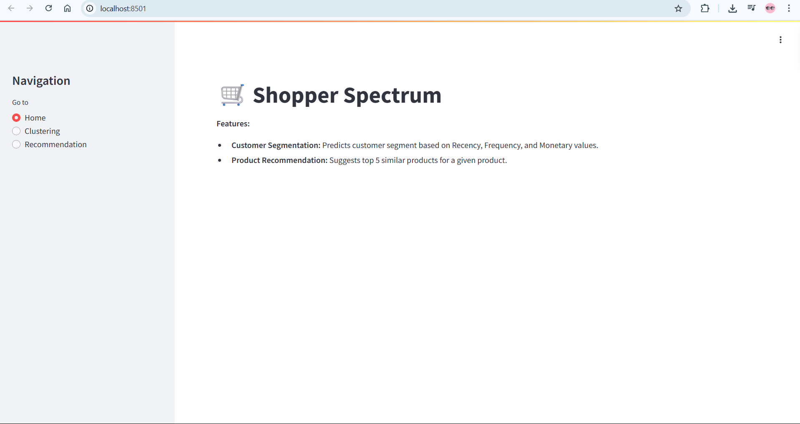
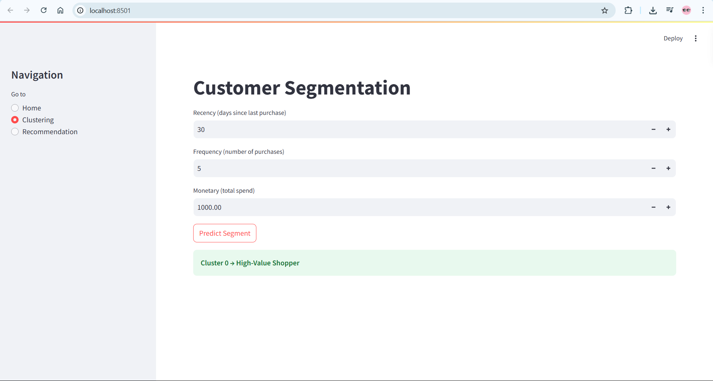
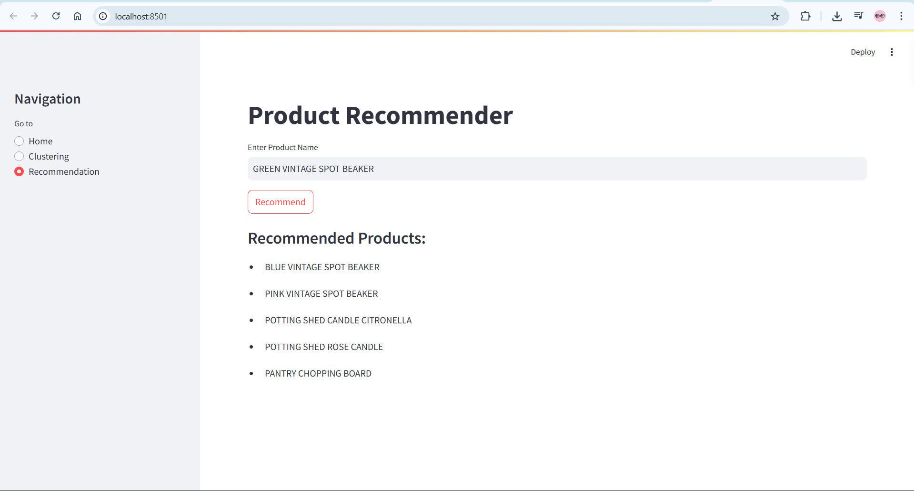

# 🛍️ Shopper Spectrum – Customer Insights & Product Recommender

**Shopper Spectrum** is a Streamlit-based full-stack data product that offers:
- **Customer Segmentation** using RFM (Recency, Frequency, Monetary) analysis and clustering.
- **Product Recommendation System** based on product similarity.

---

## 🚀 Features

- 🎯 **Customer Segmentation**: Classify shoppers into clusters like *High-Value*, *Regular*, *Occasional*, or *At-Risk*.
- 🔍 **Product Recommender**: Suggests top 5 similar products based on a given input product.
- ☁️ **Model Download**: Automatically downloads `product_similarity.pkl` from Google Drive if not found locally.

---

## 🧩 Tech Stack

- **Frontend**: Streamlit
- **Backend**: Python, Scikit-learn, Numpy, Pandas
- **Data**: Pretrained clustering model, scaler, and product similarity matrix
- **Others**: `gdown` (for Google Drive file download)

---

## 📁 Folder Structure

```
📦 Shopper-Spectrum/
├── final_app.py
├── rfm_clustering_model.pkl
├── rfm_scaler.pkl
├── requirements.txt
└── README.md
```

---

## ▶️ Getting Started

### 1. Clone the repo

```bash
git clone https://github.com/Alfiya-Simran/shopper-spectrum.git
cd shopper-spectrum
```

### 2. Install dependencies

```bash
pip install -r requirements.txt
```

### 3. Run the app

```bash
streamlit run final_app.py
```

The app will start in your browser at `http://localhost:8501`.

---

## 🔗 Google Drive Link (for `product_similarity.pkl`)

The app will automatically download the file using:

```
https://drive.google.com/uc?id=1jGXWvbhCXwfuhn9D-q2x7f1EvzLKt0Op
```

---

## 📌 Dependencies (requirements.txt)

```
streamlit
gdown
numpy
pandas
scikit-learn
```

---

## 📸 Screenshots

> ### 🔹 Home Page


> ### 🔹 Clustering Feature


> ### 🔹 Product Recommendation


---

## 🙌 Acknowledgements

- Built for learning, showcasing data science skills, and improving customer understanding in e-commerce.

---

## 📬 Contact

**Alfiya Simran**  
📧 alfiyasimran05@gmail.com  
🔗 www.linkedin.com/in/alfiyasimran
